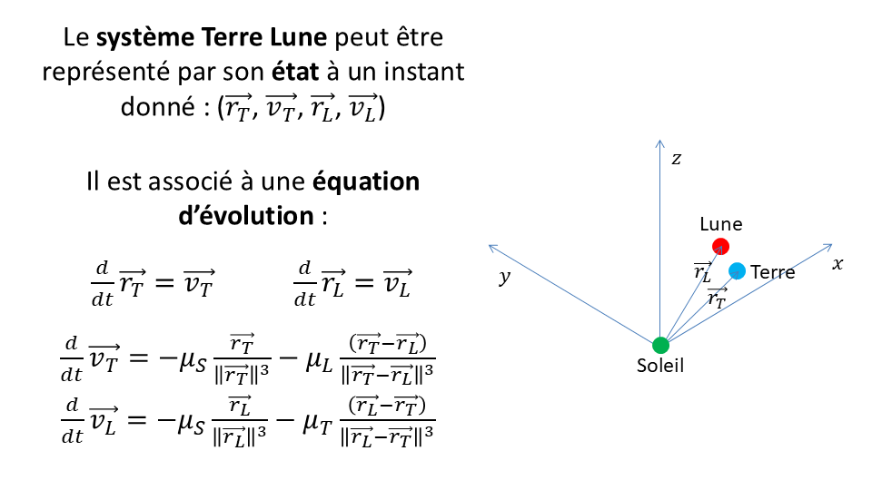
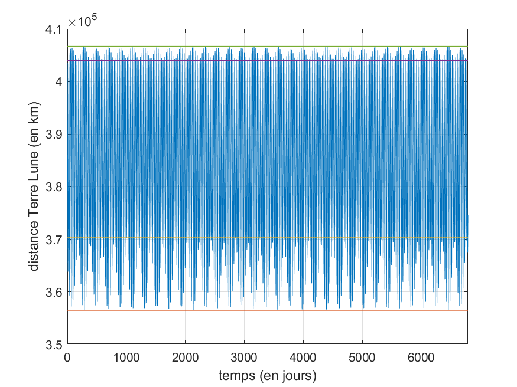
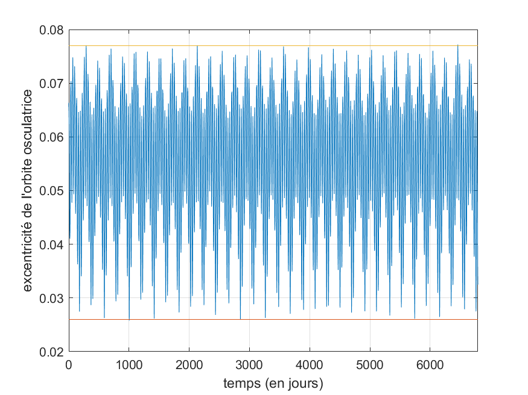
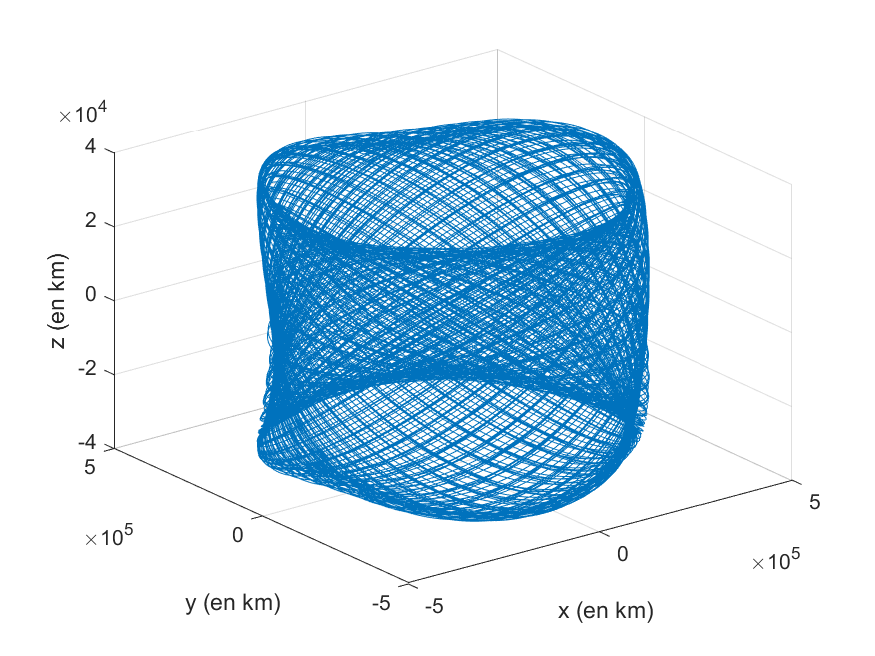

# Le système Terre Lune

## Informations générales

Les informations connues sur l'orbite de la Lune :

- https://fr.wikipedia.org/wiki/Orbite_de_la_Lune

- https://media4.obspm.fr/public/AMC/pages_eclipses-lune/stlp-mouvement-reel-ligne-noeuds-lune.html

Définition du repère géocentrique écliptique :

- https://media4.obspm.fr/public/AMC/pages_defrepere/repere-ecliptique.html

Définition de l'orbite osculatrice :

- https://fr.wikipedia.org/wiki/Orbite_osculatrice

## Description



## Génération des données

```
>> terrelune
```

## Résultats








https://github.com/user-attachments/assets/3aa13a1f-e6a9-46d8-9e54-80170c026bbc


